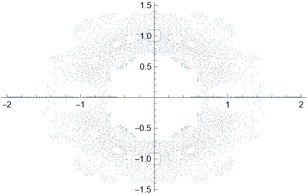
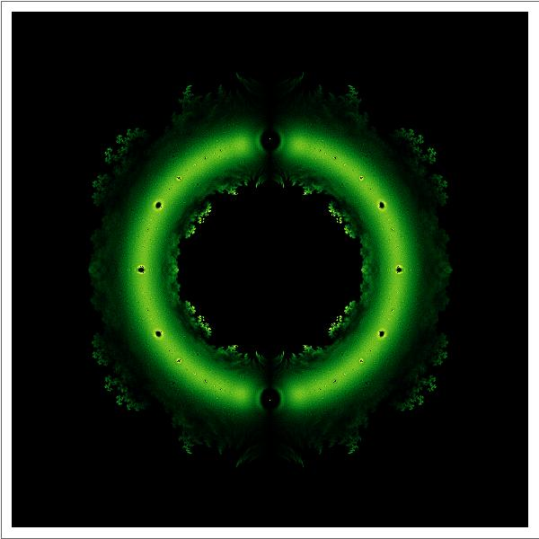

# 系数为±1的n次方程根在复平面的分布

### 引子

Mathematica的基础语法三句话就能解决：

1.内置函数的每个单词以大写字母开头。

2.函数用[]传参。

3.List用{}包围。

```mathematica
{1，2，3}
{{1，2}，{3，4}}
```

由于Mathematica的语法糖实在是太多太多太多了，所以这里我尽量使用最基础的语法。可能看着不好看，但是保看懂。（Mathematica不带转义md的功能，所以这个文档的代码显示并不好）

这个问题来自于10年前百度贴吧Mathematica吧的一个帖子，我们尝试复现一下这个问题。

### 生成方程并提取方程的解

系数为±1的二次方程长这样：

```mathematica
In[]:=x^Range[0, 2] . # == 0 & /@ Tuples[{-1, 1}, 3]
Out[]={-1 - x - x^2 == 0, -1 - x + x^2 == 0, -1 + x - x^2 == 
  0, -1 + x + x^2 == 0, 1 - x - x^2 == 0, 1 - x + x^2 == 0, 
 1 + x - x^2 == 0, 1 + x + x^2 == 0}
```

In和Out代表运行语句和运行结果，不用管它们。你只需要看Out后头生成的东西。这里使用的生成方法是穷举-1和1的n+1元组合与x的从0到n次幂点乘等于0。但是这个方法有点儿慢，用代数数可以快点儿。

```mathematica
In[]:=AlgebraicNumber[x, {1, -1, 1, 1, -1}] == 0
Out[]=1 - x + x^2 + x^3 - x^4 == 0
```

严格来说，Mathematica内部的代数数函数是有点儿问题的，因为它允许系数取实数范围，不过这不重要，重点是我们生成了一个符合题干要求的方程，而且这个语法比上头那个好使一万倍。

接下来，解方程。先想到的肯定是NSolve，Solve用于求某个方程的解析解，NSolve用于求某个方程的数值解。

```mathematica
In[]:=NSolve[AlgebraicNumber[x, {1, -1, 1}] == 0, x]
Out[]={{x -> 0.5 - 0.866025 I}, {x -> 0.5 + 0.866025 I}}
```

画图肯定不能指望这玩意儿画，所以要想办法提取出来解。用TreeForm分析层次（或者瞪眼法也行）可知，第一层是包含两个List的List，第二层是包含每个解的List，第三层是->（Mathematica中称为Rule）。[[]]可以用来提取解，而ReIm函数可以将解的实部和虚部生成一个List返回。

```mathematica
In[]:=ReIm[NSolve[AlgebraicNumber[x, {1, -1, 1}] == 0, x][[All, 1, 2]]]
Out[]={{0.5, -0.866025}, {0.5, 0.866025}}
```

尝试画个图先

```mathematica
In[]:=ListPlot[ReIm[NSolve[AlgebraicNumber[x, {#1, #2, #3, #4, #5, #6, #7, #8, #9, #10}] ==0, x][[All, 1, 2]]] & @@@ Tuples[{-1, 1}, 10]]
```

其中ListPlot为绘制散点图，@@@用于替换表达式的一级标头（TreeForm的第一层），#和&为纯函数的自变量和结尾标识，这个图长这样：



然后你发现你的电脑有点儿卡了。

### 效率问题

我们循规蹈矩一点儿，至少还有两招能用。

> 1.小数比整数快。

如果你在Mathematica计算1/2，结果会返回二分之一。同理的，解方程也会如此。

```mathematica
In[]:=Solve[2 x^2 + 3 x + 4 == 0, x]
Out[]={{x -> 1/4 (-3 - I Sqrt[23])}, {x -> 1/4 (-3 + I Sqrt[23])}}
In[]:=Solve[2.0  x^2 + 3.0  x + 4.0 == 0.0, x]
Out[]={{x -> -0.75 - 1.19896 I}, {x -> -0.75 + 1.19896 I}}
```

Mathematica中整数的精度不是1，而是无穷。我们显然不需要那么高的精度，用机器精度足以完成任务了。

> 2.专用函数比通用函数快。

Solve和NSolve的求解原理是求f(x)=0的反函数，对于超越方程来说，没办法，只能是它。但是我们今天的主角是多项式，可以有更快的方法。

```mathematica
In[]:= NRoots[AlgebraicNumber[x, {1, -1, 1}] == 0, x]
Out[]=x == 0.5 - 0.866025 I || x == 0.5 + 0.866025 I
```

NRoots给出一个多项式方程的数值近似解。

验证一下NRoots和NSolve哪个更快,求解1000个方程比较一下。

```mathematica
In[]:=AbsoluteTiming[Do[List@@NRoots[AlgebraicNumber[x, {4., 3., 2., 1.}] == 0, x][[All, 2]], {1000}]]
Out[]={0.0411889, Null}
In[]:=AbsoluteTiming[Do[List@@NSolve[AlgebraicNumber[x, {4., 3., 2., 1.}] == 0, x][[All, 1, 2]], {1000}]]
Out[]={1.1734, Null}
```

一个0.04秒，一个1.17秒，差距相当明显。

如法炮制，我们观察一下结构（或者使用TreeForm），第一层是Or，也就是||，第二层是用Equal（==）连接的x与对应解。开始替换。

```mathematica
In[]:=ReIm[List @@ NRoots[AlgebraicNumber[x, {1, -1, 1}] == 0, x][[All, 2]]]
Out[]={{0.5, -0.866025}, {0.5, 0.866025}}
```

理论上，只要把这玩意儿封装成函数，画个散点图这事儿就结束了。但是还是别这样了，我试过了，13次方程，用了65秒，全程内存占用没下700M。


### 师夷长技以制夷

思考一个问题：**我真的需要求出所有的方程的解吗？**

x^2+x+1==0和-x^2-x-1==0的解是一模一样的，之前生成的这些方程中有一半是求解了也没用的。所以我们只需要考虑最高次系数为正1的情形。

```mathematica
f[list_]:=List@@NRoots[AlgebraicNumber[x,Append[list,1]]==0,x][[All,2]]
```

Append用于在列表末尾插入值。

再试试？

```mathematica
In[]:=AbsoluteTiming[f /@ Tuples[{-1, 1}, 13]]
Out[]={6.16429,{...}}
```

现在我们倒是求出来了13次方程的所有解，然而吧主的最终图像中求解了19次方程，这个时间是6.16秒的5个数量级，而且这还没计算画图时间。显然，这是我们承受不起的。

然后，我们发现了一个悲哀的事实：

**Mathematica中NRoots的求解效率比MATLAB中的roots低了一个数量级！**

幸运的是，MATLAB可以随意篡改函数的源代码，一句话就可以一睹这个函数的芳容：

```matlab
edit(which("roots.m"))
```

举例说明一下原理：

已知三次多项式方程：
$$
a_3x^3+a_2x^2+a_1x+a_0=0
$$
构造矩阵：
$$
A=\begin{bmatrix}
 -\frac{a_2}{a_3}  & -\frac{a_1}{a_3} &-\frac{a_0}{a_3} \\
  1 & 0 & 0\\
 0 & 1 & 0
\end{bmatrix}
$$
解为：
$$
x=\begin{bmatrix}
x_1\\x_2\\x_3
\end{bmatrix}
$$
对解有Ax=λx，则有方程：
$$
\begin{matrix}
-\frac{a_2}{a_3}x_1-\frac{a_1}{a_3}x_2-\frac{a_0}{a_3}x_3=\lambda x_1\\
x_1=\lambda x_2\\
x_2=\lambda x_3
\end{matrix}
$$
代入原方程就可以把求解方程的解转化为求解矩阵的特征值，以上原理对n次方程依然成立。

明白了原理就可以自己写一个类似的，不过我们只要系数±1的情况所以不必完全照抄。

```mathematica
modifiedroots[c_List]:=Module[{a},a=DiagonalMatrix[ConstantArray[1.,Length[c]-1],-1];
a[[1]]=-c;
Eigenvalues[a]
];
```

（顺带一提Mathematica里头用个局部变量麻烦得可怕，同样可怕的是字符串拼接，不过今天的内容不涉及）

算14次方程的时候这个函数竟然只用了1.23秒！（我们一共计算了2^14个方程）

准备绘图。不过我们换个方式。前头的两个散点图太难看了，我们改成密度图。

首先对点的分布进行统计。既然效率提高了就直接上18次方程。

```mathematica
In[]:=n = 18;
data = ReIm[Flatten[modifiedroots /@ Tuples[{-1, 1}, n]]];
counts = BinCounts[data, {-2, 2, 4./601}, {-2., 2., 4./601}];
Sort[Flatten[counts]]
Out[]=(*这里的输出有多于36万个元素，不进行列举*)
```

将统计结果转化为平面直角坐标系中的对应点的灰度：

```mathematica
ArrayPlot[counts]
```

大概长这样：


### 合理的篡改

这个图并不好看，甚至于说没有观察价值。

回到数据观察，我们发现这个数据集中有一大半的0和一大半1000以上的数据。光学的衍射实验中也有类似的情况，称为衍射主极大。我们平常在书上看到的衍射图样都是被处理过的，实际上，真正的衍射实验中中间的条纹光强是远高于边缘的小条纹的。

```mathematica
In[]:=Sort[Flatten[UnitStep[300 - counts]*counts]]
Out[]=(*这里的输出有多于36万个元素，不进行列举*)
```

UnitStep在x＜0时取0，x≥0时取1。

再画一下图：

```mathematica
ArrayPlot[UnitStep[300 - counts]*counts]
```


改个颜色：

```mathematica
ArrayPlot[UnitStep[300 - counts]*counts,ColorFunction->"AvocadoColor"]
```



大功告成！

### 更严重的问题

到现在为止，题干的问题就算解决了，我们得到了一个环，还是带刺的。

那如果是24次方程呢？

时间不是最大的问题，最大的问题在内存上，反正我是不敢在我的小家伙上跑这玩意儿了。问题在哪儿呢？肯定不在那2的24次方个±1上，那就只可能在遍历上了。Mathematica在遍历的时候是不对已遍历的数据进行处理的，也就是说，连带着已经遍历完的数据，原始数据，正在遍历的数据和还没遍历的数据一起堆在了内存里，这就很可怕了。

想想办法，生成一个，计算一个，扔掉一个。

无论怎么生成，我们最终要的是1和-1组成的序列，所以我们可以使用二进制生成。

```mathematica
gene[num_,n_]:=(-1.)^IntegerDigits[num,2,n];
```

这个函数生成-1与长为n的二进制序列的每一位的幂的List。

但是如果用这个的话BinCounts又用不了了，因为它一次只产生一组方程的解。

所以又要重写计数函数。

至于这部分，还是参考原帖吧，放弃复原了……

### 尾声

实在话，讲Mathematica是不那么简单的事儿，因为它的语法糖和函数嵌套实在是多得丧心病狂。自己用还行，一讲就寄了。最早准备讲讲Julia，结果我用了半天发现这玩意儿连包都不成气候那还用个锤子。

至于今天讲的内容，如果你看不懂编程语言也没关系，总之就是探索了如何高效地解大量的方程并将它们的解可视化。

886886

参考链接：

<a>https://jump2.bdimg.com/p/3622255435?pn=1</a>